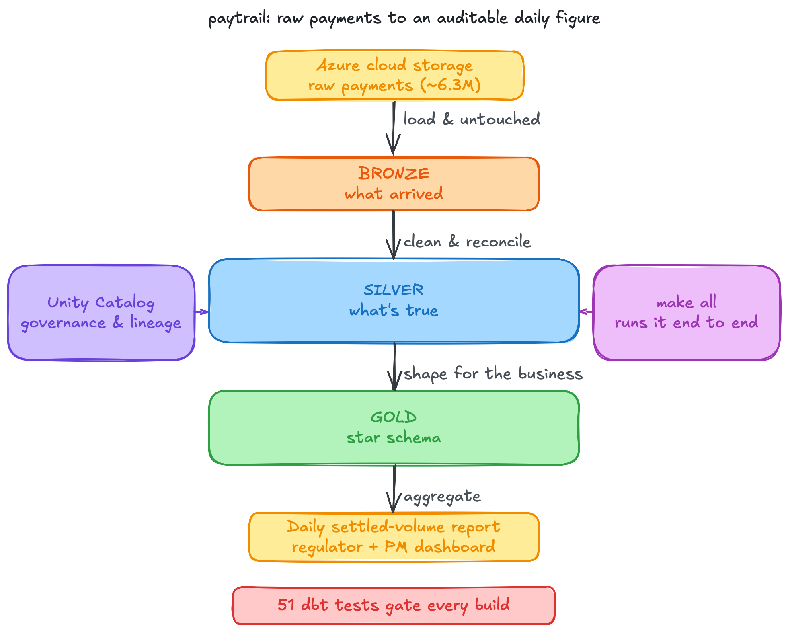
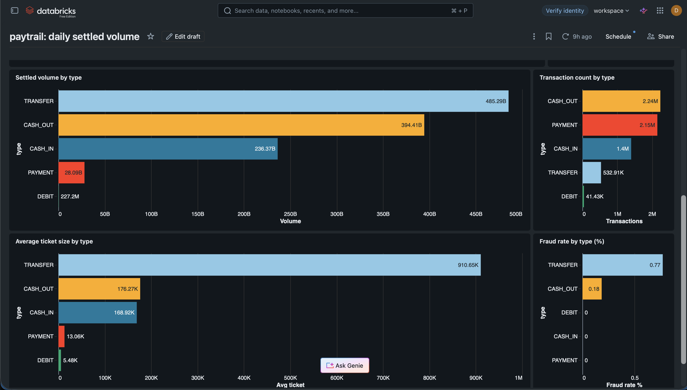

# paytrail: a payments medallion lakehouse

paytrail is a small payments warehouse over roughly 6.3M synthetic transactions. It turns them into a daily settled-volume report and checks the figures along the way, so any number can be traced back to the row it came from.



The build is three layers. The raw transactions start in Azure cloud storage, arrive in the warehouse exactly as received to keep a faithful record of the input, get cleaned and reconciled into a middle layer the downstream models build on, and finally get shaped into the tables a regulator or a product manager reads from. Bad rows are quarantined with a reason so nothing is silently discarded, re-runs never double-count, and late-arriving transactions are placed in the right window. It runs on Databricks with Delta Lake, the modelling and the data-quality tests are written in dbt, and the whole thing is governed by Unity Catalog.

There is no fraud-detection model here, on purpose. The dataset carries a fraud flag, but this project focuses on making a reported figure reconcile to the source.

A narrative walkthrough of the build and the benchmark is on my portfolio: [paytrail: building a payments warehouse](https://devikabuilds.pages.dev/notes/paytrail-payments-lakehouse/).

## Why I built this

I built paytrail in July 2026 to go deep on Databricks and the data-engineering problems particular to payments. The platform side uses Delta Lake, Unity Catalog, Asset Bundles, and Workflows. The domain side uses medallion modelling, reconciliation we can audit to the penny, and governance over sensitive account identifiers.

## Documentation map

| Document | Looking for… |
|---|---|
| README.md (this file) | What is this, what did it find, and how do I run it? |
| [docs/DATA.md](docs/DATA.md) | What is the dataset, what does each field mean, and what did the pipeline derive? |
| [docs/CONCEPTS.md](docs/CONCEPTS.md) | What do Delta Lake, the medallion pattern, and Unity Catalog mean? |
| [docs/GOVERNANCE.md](docs/GOVERNANCE.md) | How is account data masked, and how would that work with production PII? |
| [docs/AZURE.md](docs/AZURE.md) | What exactly is the Azure surface, and where's the line on what to claim? |

## At a glance

| | |
|---|---|
| Data | 6,362,620 synthetic PaySim transactions, loaded from Azure ADLS Gen2 |
| Pipeline | Delta Lake bronze → silver → gold star schema, plus a daily settled-volume mart |
| Governance | 51 dbt tests gate the build (unique / not_null / relationships / reconciliation / unit), plus a Unity Catalog column mask and automatic lineage |
| Correctness | idempotent loads, dedup, out-of-order-safe, quarantine with a reason, `bronze = clean + quarantine` reconciled to the penny |
| Orchestration | one `make all`: Asset Bundle deploy → Workflow job → `dbt build` → benchmark |
| Benchmark | heavy rollup 1.62s to 0.98s (39% faster) after `OPTIMIZE` and Z-order compaction, with the serverless caveat stated |
| Stack | Databricks (serverless, Delta, Unity Catalog, Asset Bundles, Workflows), dbt, SQL, Python, Azure ADLS Gen2, GitHub Actions |

## Run it

```bash
make all
```

It runs governance setup, deploys the Asset Bundle, ingests bronze from Azure, runs `dbt build` (every model and every data-quality test), runs the deployed Workflow gate, and benchmarks the heavy aggregation. It needs a Databricks Free Edition workspace, an Azure ADLS Gen2 storage account, and a Kaggle token for the source download.

On Free Edition, dbt runs from the Makefile, because serverless has no classic job compute for dbt or Python tasks. The deployed Workflow job is a serverless SQL governance gate that fails the run if gold is empty or the silver reconciliation identity is off.

Iterate on the 10k smoke sample, which is the default. The full 6.3M-row run is one command, kept for last to protect the Free Edition daily quota:

```bash
make ingest-full && make dbt && make benchmark
```

## Architecture

The diagram above shows the flow. The table-level detail, each table and what it contains, is in [The medallion layers](#the-medallion-layers-and-why-each-boundary-exists) below.

Orchestration is code-first: a Databricks Asset Bundle deploys a Workflow job, and `make all` deploys and runs it. Governance is Unity Catalog: managed tables, a column mask on account identifiers, and automatic lineage ([docs/lineage/](docs/lineage/)).

## The medallion layers, and why each boundary exists

- **Bronze** (`transactions_raw`) is what arrived. The PaySim source arrives untouched from ADLS Gen2, append-only, every column kept as `STRING`, plus `_source_file` and `_load_ts`. Ingest is idempotent, keyed on `_source_file`, so a replayed batch is a no-op rather than a double-load.
- **Silver** (`transactions`, `transactions_quarantine`) is what's true. Types are cast defensively, so a bad value becomes a quarantine reason rather than a crashed job. Keys are conformed and tokenised (sha2), so no raw account id flows past silver. Rows are deduplicated on a natural grain, and the load is out-of-order-safe: ordered by the event clock, latest load wins within a grain. Rows that fail a contract are quarantined with a reason so nothing is silently discarded, and a reconciliation control proves it: `bronze = clean + quarantine`, with amounts tying to the penny.
- **Gold** (star schema and mart) is what the business consumes. `fact_transaction` (an incremental `MERGE`) plus four dimensions feed `mart_daily_settled_volume`, one reconciled grain that serves both a regulatory-reporting-style daily aggregate and a product-manager view of type × customer segment.

## Dashboard

The gold mart feeds a Databricks AI/BI (Lakeview) dashboard: a product manager's view of daily settled volume by transaction type and by customer segment. It is built code-first (`make dashboard`, definition in [bi/paytrail_mart.lvdash.json](bi/paytrail_mart.lvdash.json)) and published to the Databricks workspace.




**Reading it.** Three of the fields on the dashboard are derived by the pipeline rather than taken straight from PaySim. What each one means:

- **Customer segment** (high / medium / low) is not in the source. It is a tertile of each customer's total originated amount, the volume band a product manager slices markets by. Because the band is *defined* by volume, the "settled volume by segment" bar is partly definitional (the high band leads by construction), so read it as the spread of activity across bands.
- **"Settled" is a reporting frame over the whole dataset.** PaySim has no settlement state, so settled volume is the sum of every transaction amount, fraud included. The mart demonstrates the daily-reconciliation pattern and leaves every row in place.
- **The date axis is a synthetic calendar.** PaySim carries an hourly `step` in place of calendar dates, anchored here to 2023-01-01. The shape of the trend is accurate, while the specific dates are placeholders, so read the line for its overall pattern.
- **"Average ticket" is payments jargon** for average transaction amount (settled volume ÷ transaction count per type).

## dbt tests are the governance layer

Data-quality tests are the merge gate: a failing test fails the build. The suite is 51 tests (49 data tests and 2 unit tests): `unique` and `not_null` on keys, `relationships` on every fact-to-dimension foreign key, `accepted_values` on enums, source freshness, a reconciliation singular test (`bronze = clean + quarantine`, amounts tie), and dbt unit tests that prove the quarantine-reason mapping and the dedup-keeps-latest logic on crafted inputs. The PaySim sample is clean, so only mocked rows can exercise those paths. CI ([.github/workflows/ci.yml](.github/workflows/ci.yml)) runs ruff, mypy, sqlfluff, and `dbt parse` on every push, plus the full `dbt build` gate when warehouse secrets are present.

## Unity Catalog lineage

Unity Catalog captures lineage automatically. The export at [docs/lineage/lineage.md](docs/lineage/lineage.md) covers the bronze → silver → gold graph, so any gold figure traces back to the raw bronze row it derives from. The governance mechanics, a column mask on account identifiers and the PII / PCI-DSS / GDPR mapping, are in [docs/GOVERNANCE.md](docs/GOVERNANCE.md).

## Benchmark

One heavy aggregation, measured before and after a layout change I control: `OPTIMIZE ... ZORDER BY (date_key, transaction_type)`, on the full 6.3M-row fact table. Server execution went from 1.62s to 0.98s (39% faster), and files read went from 96 to 4. The isolated win is compaction: the small-files penalty removed.

The benchmark is candid about what did not happen. Z-order file pruning never kicked in (`pruned_files_count = 0` even at 6.3M rows), because `OPTIMIZE` compacts the data into just 4 large files each spanning about a week, so a 14-day filter overlaps every one of them. It also states the serverless caveat: Free Edition applies Predictive I/O and automatic optimisation by default, so wall-clock is noisy, and the reliable evidence is the server time and the file-count change.

## Scope

- **Azure is storage integration (ADLS Gen2).** The source is stored in and read from Azure Data Lake Storage Gen2, and the compute is Databricks Free Edition (AWS-hosted) (see [docs/AZURE.md](docs/AZURE.md)).
- **The data is synthetic (PaySim).**

## Stack

Databricks (serverless, Delta Lake, Unity Catalog, Asset Bundles, Workflows), dbt, SQL, Python, Azure ADLS Gen2, GitHub Actions. Concepts reference: [docs/CONCEPTS.md](docs/CONCEPTS.md).
